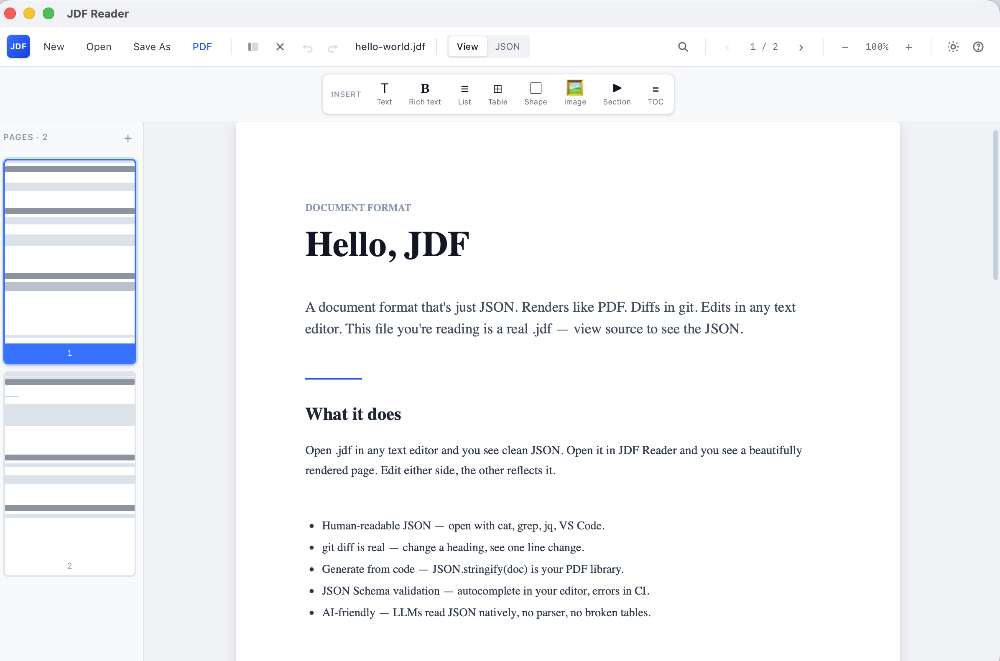
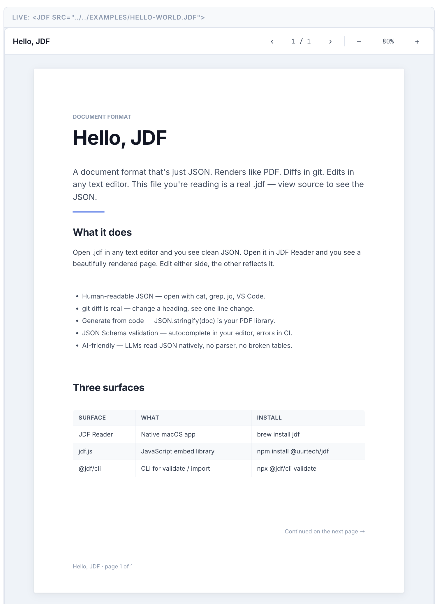

# JDF — JSON Document Format

A document format that's just JSON. Open `.jdf` in any text editor and you see the source. Open it in JDF Reader and you see a rendered page. Edit either side, the other reflects it.

<p align="center">
  
<br>

</p>

JDF runs in three places:

| Surface | What it is | Install |
|---|---|---|
| **JDF Reader** | Native macOS app — read, edit, import PDF/MD, export PDF | `brew tap uurtech/jdf && brew install jdf` |
| **jdf.js** | JavaScript library — embed `.jdf` files on any web page | `npm install @uurtech/jdf` or `<script src="https://unpkg.com/@uurtech/jdf">` |
| **`@uurtech/jdf-cli`** | CLI for validating documents and converting from Markdown | `npx @uurtech/jdf-cli validate file.jdf` |

## Why JDF

It's JSON. Every consequence below falls out of that:

- `cat`, `grep`, `jq`, VS Code, every linter — they all work, no plugin.
- `git diff` shows the actual change, line-level.
- Generating a doc is `JSON.stringify(doc)`.
- A JSON Schema validates structure (`spec/jdf-schema.json`) and powers IDE autocomplete.
- Search is text search. `grep "TODO" *.jdf` works.
- No vendor, no proprietary parser. Opens the same way today and in 20 years.

## Install

### Desktop · macOS

```bash
brew tap uurtech/jdf
brew install jdf
```

`brew` clones the tap, downloads the latest `.dmg` from the GitHub release, and installs `JDF Reader.app` into `/Applications`.

Upgrade later:

```bash
brew upgrade --cask jdf
```

The Cask formula lives in a separate tap repo: [`uurtech/homebrew-jdf/Casks/jdf.rb`](https://github.com/uurtech/homebrew-jdf/blob/main/Casks/jdf.rb). A reference copy is also kept in this repo at [`Casks/jdf.rb`](Casks/jdf.rb).

Linux and Windows builds (`.deb`, `.AppImage`, `.rpm`, `.msi`, `.exe`) are produced by the GitHub Actions release workflow on every tag — see the [latest release](https://github.com/uurtech/jdf/releases/latest).

### Web · jdf.js

Embed JDF documents on any web page with one tag:

```html
<link rel="stylesheet" href="https://unpkg.com/@uurtech/jdf/dist/jdfjs.css">
<script type="module" src="https://unpkg.com/@uurtech/jdf"></script>

<jdf src="/whitepaper.jdf"></jdf>
```

Or via npm for full programmatic control:

```bash
npm install @uurtech/jdf
```

```js
import { embed } from "@uurtech/jdf";
import "@uurtech/jdf/style.css";

await embed("#viewer", "/doc.jdf", { zoom: 1.2, sidebar: true });
```

See **[the jdf.js README](jdfjs/README.md)** and the **[embed documentation](docs/docs/embed/index.html)** for the full API, attribute reference, and framework integrations (React / Vue / Svelte).

### Build from source

```bash
git clone https://github.com/uurtech/jdf.git
cd jdf
pnpm install
pnpm tauri build      # produces .app + .dmg in apps/reader/src-tauri/target/release/bundle/
```

Requires Node 20+, pnpm 9+, Rust stable, Xcode CLT (macOS).

## Open & edit

**Open**: drag any `.jdf`, `.pdf`, or `.md` onto the welcome screen, double-click in Finder (file associations are registered), or `Cmd+O`.

**Edit a paragraph**: double-click it. The whole paragraph (or heading, list item, table cell, collapsible title, image src/alt) becomes an inline editor. Type. Press `Enter` or click anywhere else — the change saves to disk in ~150 ms.

**Restructure**: hover any element. A floating toolbar pops up in the top-right corner with **↑ Move up · ↓ Move down · ⧉ Duplicate · × Delete**. No right-click, no menu hunting.

**Insert new elements**: the Insert bar at the top of every page lets you append a Text / Rich text / List / Table / Shape / Image / Section / TOC element with a single click.

**Pages**: the sidebar shows a thumbnail preview of every page. Click `+` for a new page. Hover any thumbnail and click the red `×` to delete it.

**Undo / redo**: `⌘Z` / `⌘⇧Z` — 100-step history. Includes every text edit, structural change, and JSON view commit.

**Multiple windows**: `⌘N` or the toolbar "New" button. Compare two documents side-by-side.

**Memory model**:
- A `.jdf` opens in memory and **auto-saves** to its source file on every commit.
- A `.pdf` or `.md` is converted to JDF in memory only — the original file is never touched. The toolbar shows `● Unsaved (in memory)` while you edit. If you close the window with unsaved changes, you get a prompt to save it as `.jdf` or discard.
- The JSON view is a live two-way bind. Edit JSON, blur or `Cmd+S`, and the rendered view follows. Edit visually, the JSON updates as you go.

## Feature matrix — what runs where

JDF lives in three runnable surfaces. They all consume the same `.jdf` file but expose different feature sets — the desktop Reader is the only place you edit, jdf.js is a renderer, the CLI is for validation and conversion.

Legend: ✓ supported · ◐ partial / planned · — not applicable

### Document rendering (the bits that turn JSON into pixels)

All three renderers walk the same JSON. The desktop Reader and jdf.js are kept at strict feature parity for everything below.

| Capability | JDF Reader | jdf.js | CLI |
|---|:---:|:---:|:---:|
| `text` element (heading 1-6, align, link, tocEntry, style) | ✓ | ✓ | — |
| `richtext` element (per-run bold/italic/underline/strikethrough/color/font/link) | ✓ | ✓ | — |
| `image` element (base64 resource OR src URL/path; `fit` modes) | ✓ | ✓ | — |
| `table` element (headers, colspan/rowspan, alternating rows, borders, column align) | ✓ | ✓ | — |
| `list` element (ordered/unordered, nested with per-item type override) | ✓ | ✓ | — |
| `shape` element (rect, circle, ellipse, line, SVG path; fill/stroke/opacity) | ✓ | ✓ | — |
| `collapsible` element (expandable section with nested elements) | ✓ | ✓ | — |
| `toc` element (auto-generated, hierarchical, click-to-navigate) | ✓ | ✓ | — |
| Page sizes A4/A3/A5/Letter/Legal/Tabloid + custom `{width,height}` | ✓ | ✓ | — |
| Portrait / landscape (doc-level + per-page override) | ✓ | ✓ | — |
| Margins (doc-level merged with per-page) | ✓ | ✓ | — |
| Headers / footers (template strings AND full element trees) | ✓ | ✓ | — |
| Internal links (`#page-N` navigation) | ✓ | ✓ | — |
| External links (open in new tab) | ✓ | ✓ | — |
| Named styles (`styles.foo` referenced as string / array / inline) | ✓ | ✓ | — |
| Dark mode | ✓ | ✓ | — |
| Multi-page scroll + page indicator | ✓ | ✓ | — |
| Sidebar with page thumbnails | ✓ | ✓ (opt-in via `sidebar`) | — |
| Toolbar (zoom, page nav, search) | ✓ | ✓ (opt-in via `toolbar`) | — |
| Fit modes (`fit-width`, `fit-page`, manual zoom) | ✓ | ✓ | — |
| Reactive attributes — change `src`/`width`/`zoom` and the viewer updates | — | ✓ | — |

### Editing (read/write workflow)

Editing lives in the desktop Reader only — jdf.js is a viewer, the CLI is non-interactive.

| Capability | JDF Reader | jdf.js | CLI |
|---|:---:|:---:|:---:|
| Double-click any element to edit in place | ✓ | — | — |
| Inline editor for headings, paragraphs, list items, table cells, collapsible titles, image src/alt | ✓ | — | — |
| Auto-save to disk (~150 ms after edit) | ✓ | — | — |
| Hover toolbar — Move up / Move down / Duplicate / Delete (no right-click) | ✓ | — | — |
| Insert bar — Text / Rich text / List / Table / Shape / Image / Section / TOC | ✓ | — | — |
| Page management (add page, delete page, drag thumbnails) | ✓ | — | — |
| Undo / redo (`⌘Z` / `⌘⇧Z`, 100-step history) | ✓ | — | — |
| Live JSON view with two-way bind | ✓ | — | — |
| Multiple windows (`⌘N`) | ✓ | — | — |
| File associations (double-click `.jdf` in Finder) | ✓ | — | — |

### Import & convert

| Capability | JDF Reader | jdf.js | CLI |
|---|:---:|:---:|:---:|
| Open `.jdf` from disk | ✓ | ✓ (via `<jdf src>` / `embed()`) | ✓ (`validate`) |
| Import `.md` → `.jdf` | ✓ | — | ✓ (`jdf import file.md`) |
| Import `.pdf` → `.jdf` (full fidelity: positions, fonts, colors, shapes, embedded images) | ✓ | — | ◐ (planned — currently delegates to the desktop importer) |
| JSON Schema validation | ✓ (live, in-app) | — | ✓ (`jdf validate file.jdf`) |
| Markdown viewer (native render, no conversion) | ✓ | — | — |

### Export

| Capability | JDF Reader | jdf.js | CLI |
|---|:---:|:---:|:---:|
| Export to PDF (`Cmd+Shift+E`) — preserves text, images, vector shapes, fonts, colors | ✓ | — | ◐ (planned) |
| Save edits back to source `.jdf` | ✓ (auto) | — | — |
| Save imported PDF/MD as `.jdf` | ✓ | — | — |

### Distribution / install

| Surface | How to get it |
|---|---|
| **JDF Reader** (macOS) | `brew tap uurtech/jdf && brew install jdf` — DMG / `.app`, signed via GitHub release |
| **JDF Reader** (Linux / Windows) | `.deb` / `.AppImage` / `.rpm` / `.msi` / `.exe` from the [latest release](https://github.com/uurtech/jdf/releases/latest) |
| **jdf.js** | `npm install @uurtech/jdf` or `<script src="https://unpkg.com/@uurtech/jdf">` |
| **`@uurtech/jdf-cli`** | `npx @uurtech/jdf-cli validate file.jdf` (no install) |

## Page model

Page sizes: A4, A3, A5, Letter, Legal, Tabloid, custom (`{width, height}` in mm). Portrait or landscape — set at the document level (`meta.pageOrientation`) or per-page. Margins are merged: doc-level `meta.margins` + per-page overrides. Headers and footers accept either a template string (`{{pageNumber}} {{totalPages}} {{title}} {{author}}`) or a full element tree.

Element-by-element capabilities are listed in the [Feature matrix](#feature-matrix--what-runs-where) above; the JSON Schema in [`spec/jdf-schema.json`](spec/jdf-schema.json) is the source of truth.

## PDF import: full fidelity

Drag a `.pdf` onto the viewer and you get an editable JDF copy that **looks identical to the original** — no "best effort", no placeholders.

Per text run, the importer extracts:
- **position** (mm) — via PDF.js `viewport.convertToViewportPoint`, accounting for rotation, CropBox, and MediaBox offset.
- **font family** — looked up from PDF.js `commonObjs` cache, mapped to `Inter / Times New Roman / JetBrains Mono` based on the original font name.
- **font size** in points (from the text matrix scale).
- **bold / italic** — detected from the real font name (`Helvetica-Bold`, `Times-Italic`, etc).
- **color** — from `setFillRGBColor / setFillGray / setFillCMYKColor` walked over the operator list, snapshotted at each text-show op.
- **opacity** — from `ca` / `CA` in `setGState`.
- **invisible text** — text rendering mode 3 (used for OCR layers) is filtered out.
- **link annotations** — `getAnnotations()` rectangles are matched to text runs and emitted as JDF `link`s.

For graphics:
- **Vector shapes**: rectangles, lines, and arbitrary paths from `constructPath` are emitted as `shape: rect | line | path` with their fills, strokes, stroke widths, and `opacity`. Cubic and quadratic Bezier curves preserved as SVG `C` segments.
- **Embedded images**: `paintImageXObject` ops are followed back to `page.objs`, decoded into RGBA via canvas, encoded to base64 PNG, stored in `resources.images`, and placed at their original transform on the page.

The result: PDF heading → JDF heading element with right size, right font, right color, right position. PDF table → individual cell text elements at the right grid coordinates. PDF logo → embedded base64 image at its real placement. Then you double-click any of it to edit.

## PDF export

Round-trip back to `.pdf` via the toolbar (or `Cmd+Shift+E`). Respects:
- `meta.pageSize` and `pageOrientation` (A4 / A3 / A5 / Letter / Legal / Tabloid / custom; portrait / landscape; doc-level + per-page overrides).
- `style.color` on every text element via `set_fill_color`.
- Text, richtext, lists, tables, collapsibles, shapes — all rendered.
- **Embedded images**: base64 → image crate decoder → printpdf `ImageXObject`. The Markdown / PDF imports' images come back out the other end.
- TOC — iterated from the document's headings into a real PDF table-of-contents.

## Markdown

`.md` opens with a continuous-scroll, GitHub-style render (`marked`, full GFM: tables, blockquotes, code, links, images, task lists, hr, strikethrough). Toolbar toggle flips to the paged JDF render of the same content. `Cmd+F` highlights matches inline with `<mark>` tags in the live MD output, line-by-line.

## RAG / AI ingestion

JDF removes most of the work a typical retrieval-augmented-generation pipeline does on PDFs. The structure that PDF parsers try to reconstruct is already in the file, so several pipeline stages become trivial or vanish entirely:

| Stage | PDF | JDF |
|---|---|---|
| **Parse / extract** | `pdfplumber` / `pymupdf` / `unstructured` — layout analysis, font heuristics, OCR fallback for image-only pages | `JSON.parse(content)` — no layout reconstruction, the structure is already in the file |
| **Chunking** | Token-windowed splits that frequently slice through tables, lists, footnotes | Each element (`text`, `richtext`, `table`, `list`, `image`) is a natural retrieval unit — no chunker config |
| **Metadata** | Synthesized after the fact (page number, "is this a heading?") and often wrong | First-class on every element: `type`, `heading`, page index, position, link target |
| **Embedding noise** | Repeated page headers / footers / page numbers leak into chunks | `header` and `footer` live in their own tree, never in content chunks |
| **Re-indexing on edit** | Re-parse + re-chunk + re-embed the whole PDF | Diff the JSON, re-embed only the changed elements |
| **Tables** | Cells smear across columns; multi-row headers collapse | `{ headers: [...], rows: [[...]] }` — every cell at its real coordinate |
| **Images** | Dropped or stubbed as `[image]` | Stored in `resources.images` with alt text and an anchor element — a vision step can fetch the image at the exact retrieval point |

> Note: the real-world speedup depends on your PDFs (text-only vs. scanned), parser, and chunker. We haven't published benchmark numbers — the wins above are structural (steps you no longer have to do), not measured timings. If you run a comparison on your own corpus, please open an issue with the methodology.

A minimal RAG ingestor for JDF is a single loop — no PDF library, no layout heuristics, no chunker config:

```ts
import fs from "node:fs/promises";
import type { JdfDocument } from "@jdf/core";

const doc: JdfDocument = JSON.parse(await fs.readFile("paper.jdf", "utf8"));

for (const [pageIndex, page] of doc.pages.entries()) {
  for (const el of page.elements) {
    const text =
      el.type === "text" || el.type === "richtext" ? el.content :
      el.type === "list"  ? el.items.map(i => i.content).join("\n") :
      el.type === "table" ? [el.headers, ...el.rows].map(r => r.join(" | ")).join("\n") :
      null;
    if (!text) continue;

    await index.upsert({
      id: `${doc.meta?.title}-p${pageIndex}-${el.type}`,
      vector: await embed(text),
      metadata: {
        type: el.type,
        heading: (el as any).heading ?? null,
        page: pageIndex + 1,
        title: doc.meta?.title,
      },
    });
  }
}
```

The same pipeline against a PDF needs `pdfplumber` (or equivalent), a layout heuristic to detect headings, a chunker that respects tables, and an OCR fallback for image-only pages — and still loses fidelity at every step.

See [`docs/docs/why-ai.html`](docs/docs/why-ai.html) for the long-form discussion of why every modern LLM reads JDF more easily than PDF.

## Format

```json
{
  "$jdf": "1.0.0",
  "meta": { "title": "...", "pageSize": "A4", "unit": "mm" },
  "styles": { "heading": { "fontSize": 22, "fontWeight": "bold" } },
  "resources": { "images": { "logo": { "data": "<base64>", "mimeType": "image/png" } } },
  "header": { "content": "{{title}}" },
  "footer": { "content": "page {{pageNumber}} / {{totalPages}}" },
  "pages": [
    {
      "elements": [
        { "type": "text", "content": "Hello", "heading": 1, "position": { "x": 0, "y": 5 }, "width": 166 },
        { "type": "list", "listType": "unordered", "items": [{ "content": "one" }, { "content": "two" }], "position": { "x": 0, "y": 25 }, "width": 166 }
      ]
    }
  ]
}
```

Positions in mm (default), font sizes in pt. A4 content area: 166 × 247 mm with the default 22 / 25 mm margins.

Full schema: [`spec/jdf-schema.json`](spec/jdf-schema.json). Working example: [`spec/examples/hello-world.jdf`](spec/examples/hello-world.jdf).

Internal navigation: `link: "#page-3"` or `link: { type: "internal", target: "#page-3" }` on text/richtext.

## jdf.js — embed on the web

**`@uurtech/jdf`** (sources in [`jdfjs/`](jdfjs/)) is a small JavaScript library that turns any `.jdf` URL into a fully styled, scrollable, searchable embed in a web page. Like PDF.js — but the file is plain JSON.

### Usage

```html
<jdf src="/doc.jdf"></jdf>

<!-- Configure via attributes -->
<jdf src="/doc.jdf"
     width="800"
     height="600"
     zoom="1.2"
     sidebar="true"
     dark-mode="auto"></jdf>
```

That's the only embed form. Every `<jdf>` tag on the page is auto-detected on `DOMContentLoaded` and rendered. New tags added later (SPAs, async content) are picked up by a `MutationObserver`. To opt out per element: add `manual`. To disable globally: `window.JDFjsAutoInit = false` before loading the script.

### Configuration

| Attribute | Type | Default |
|---|---|---|
| `src` | string | required |
| `width` | number (px) or any CSS length | — |
| `height` | number (px) or any CSS length | `600px` |
| `zoom` | number | `1` |
| `fit` | `"manual"` · `"fit-width"` · `"fit-page"` | `"manual"` |
| `sidebar` | boolean | `false` |
| `toolbar` | boolean | `true` |
| `dark-mode` | `"auto"` · `"light"` · `"dark"` | `"auto"` |
| `page` | integer (0-based) | `0` |
| `manual` | boolean | — |

### Programmatic API

```js
import { embed, render, JDFViewer } from "@uurtech/jdf";
import "@uurtech/jdf/style.css";

// 1. Embed by URL
const v = await embed("#viewer", "/doc.jdf", {
  zoom: 1.2,
  sidebar: true,
  darkMode: "auto",
  width: "100%",
  height: "80vh",
  fit: "fit-width",
  onPageChange: (i) => console.log("page", i),
});
v.goToPage(2);
v.setZoom(1.5);

// 2. Render an in-memory document (no fetch)
import type { JdfDocument } from "@uurtech/jdf";
const doc: JdfDocument = { $jdf: "1.0.0", meta: { title: "Hi" }, pages: [...] };
render("#out", doc);
```

The library bundles to `dist/jdfjs.js` (~25 kB minified + gzipped). No framework, no build dependencies. Browser support: Chrome 88+, Firefox 87+, Safari 14+, Edge 88+.

Full reference: [`jdfjs/README.md`](jdfjs/README.md) · [`docs/docs/embed/`](docs/docs/embed/index.html).

## CLI

```bash
# run on demand (no install)
npx @uurtech/jdf-cli validate doc.jdf
npx @uurtech/jdf-cli import README.md          # → README.jdf
npx @uurtech/jdf-cli import paper.pdf -o out.jdf

# or install globally
npm install -g @uurtech/jdf-cli
jdf validate doc.jdf
```

`validate` runs Ajv against the JSON Schema and reports path-level errors plus warnings. `import` accepts `.md` (works) and `.pdf` (planned — currently delegates to the desktop importer).

When working from a clone of this repo, the dev entry point is `pnpm --filter @uurtech/jdf-cli start <subcommand>` — same arguments, runs from source via `tsx`.

## Keyboard shortcuts

| Shortcut | Action |
|---|---|
| `Cmd+O` / `Cmd+W` | Open / close |
| `Cmd+N` | New window |
| `Cmd+S` / `Cmd+Shift+E` | Save As `.jdf` / Export PDF |
| `Cmd+Z` / `Cmd+Shift+Z` | Undo / redo |
| `Cmd+F` | Search |
| `Cmd+B` | Sidebar |
| `Cmd+D` | Dark mode |
| `Cmd+P` | Print |
| `Cmd+=` `Cmd+-` `Cmd+0` | Zoom |
| `←` `→` | Page nav |
| Double-click | Edit element |
| `Enter` / `Esc` / `Cmd+Enter` | Commit / cancel / multi-line commit |
| `?` | Shortcut overlay |

## Project layout

```
spec/                JSON Schema + examples
packages/jdf-core/   TypeScript types + utils
jdfjs/               jdf.js — web embed library (npm: @uurtech/jdf)
apps/reader/         Tauri v2 app
  src/
    components/      element renderers, JSON view, MD view, sidebar, toolbar
    edit/            mutation API + undo/redo history
    import/          PDF.js → JDF converter
  src-tauri/         Rust backend (MD parse, PDF export with image embed, search)
tools/jdf-cli/       Ajv validate + MD→JDF importer
Casks/               Homebrew cask formula
.github/workflows/   CI (typecheck, schema validate, cargo check on 3 OSes)
                     + release (tag → multi-OS bundles)
```

Stack: Tauri v2, SolidJS, Tailwind v4, Vite, Rust (`pdf-extract`, `printpdf`, `pulldown-cmark`, `image`), Ajv, marked, pdfjs-dist.

## Status

Done:
- Full element rendering, edit-in-place + auto-save, JSON view, Markdown viewer.
- PDF import with positions, fonts, colors, opacity, links, vector shapes, embedded images.
- PDF export with page size, orientation, colors, real TOC, **embedded images**.
- Structural editing: hover action bar (move / duplicate / delete), Insert bar, page add/delete in sidebar.
- Undo / redo (100 steps, all mutations).
- Multiple windows (`⌘N`).
- macOS / Linux / Windows builds via GitHub Actions release workflow.
- JSON Schema, CLI validate, CI on all three OSes.
- Homebrew tap (`uurtech/jdf`).
- **jdf.js — web embed library** with auto-init, single `<jdf src="...">` form, feature parity with the desktop renderer.
- Published to npm as [`@uurtech/jdf`](https://www.npmjs.com/package/@uurtech/jdf) — install via `npm install @uurtech/jdf` or load from CDN at `https://unpkg.com/@uurtech/jdf`.

Not yet:
- PDF import in the CLI (works in the Reader; the CLI command currently delegates to the desktop importer).
- PDF export in the CLI.
- Editing in jdf.js (today it's strictly a renderer).
- PDF table detection (cells come in as separate text elements at correct coordinates; geometry-based row/column grouping is on the roadmap).
- Multi-page overflow on PDF export.
- Linux/Windows code signing (builds work; signing is a per-platform follow-up).
- VS Code extension (preview + schema hint).
- Apple notarization (the cask runs `xattr -cr` to clear quarantine, but a notarized build would silence Gatekeeper entirely).

See [`CHANGELOG.md`](CHANGELOG.md) for the per-release log.

## Contributing

JDF is open source — fork the repo, hack on it, open a pull request. `CONTRIBUTING.md` has the full guide; the short version:

1. Fork → branch → make your change.
2. `pnpm typecheck` and `cargo check` (in `apps/reader/src-tauri/`) must pass.
3. Add a sample to `spec/examples/` if your change affects rendering.
4. Open a PR against `master`. CI runs the same checks on every PR.

When adding a new JDF element type or attribute, update **all five** locations: `packages/jdf-core/src/types.ts`, `spec/jdf-schema.json`, `apps/reader/src/components/viewer/`, `jdfjs/src/renderers/element.ts`, and `apps/reader/src-tauri/src/commands/mod.rs`. See [`CLAUDE.md`](CLAUDE.md) for the full parity checklist.

Bug reports, feature requests, and design discussions all welcome in [GitHub Issues](https://github.com/uurtech/jdf/issues).

## License

MIT — [`LICENSE`](LICENSE).
